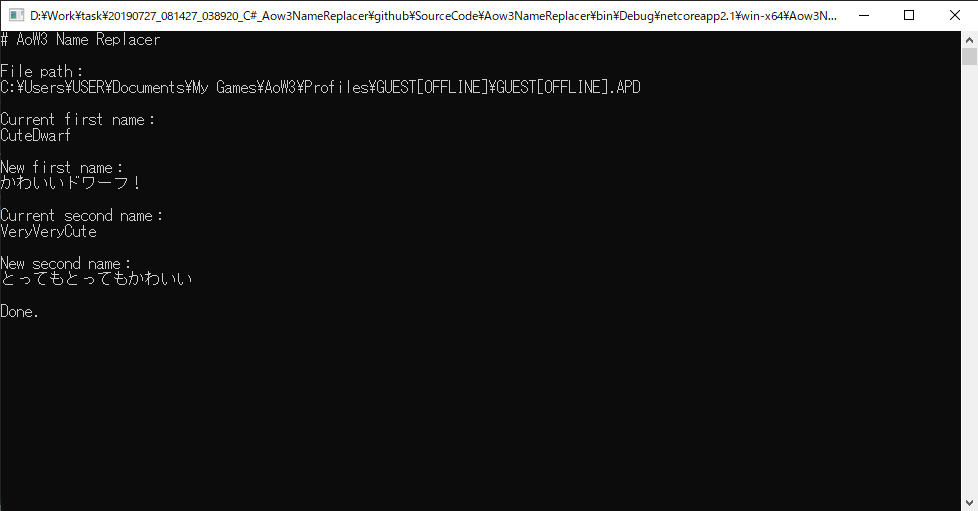

AoW3-Name-Replacer
===

## Usage
1. Start the game and create a custom hero unit. (Do not remember to save it.)


2. Exit the game.

3. Start Aow3-Name-Replace.exe.

4. Enter the absolute path of profile file([*1](#usage-4-1)) as "File path".<br>
Enter the first name of hero unit you want to change as "Current first name".<br>
Enter the first name([*2](#usage-4-2)) of the destination you want to change as "New first name".<br>
Enter the lats name of hero unit you want to change as "Current second name".<br>
Enter the lats name([*2](#usage-4-2)) of the destination you want to change as "New second name".<br>

<span id="usage-4-1" style="font-size:x-small;color:orange;">4-1: Profile files can be found at [ ``` C:\Users\{:UserName}\Documents\My Games\AoW3\Profiles ``` ].</span><br>
<span id="usage-4-2" style="font-size:x-small;color:orange;">4-2: The new name must have the same number of characters as the old name.</span>

5. Start the game, then make sure your hero unit's name has been changed.
If there is a problem, rename and revert the backup file([*1](#usage-5-1)) that is generated in the same location as the original profile file.<br>

<span id="usage-5-1" style="font-size:x-small;color:orange;">5-1: File name is [ ``` {:User}.APD.backup ``` ].</span>


## Note
- This tool provides a simple binary replacing. Therefore, depending on the name it replaces, the file may be corrupted. For example, replacing any name that corresponds to the whole or part of the name of a resource in the profile file will cause this problem. So it is recommended that the name to be replaced should be something like "xxxx" or "abcdef", which does not seem to make sense.

- The name to be replaced and the new name must have the same number of characters. Othewise the new name may be garbled.

Example:    

|old name|new name|result name|
|:---|:---|:---|
|abcde|fghij|fghij|
|abcde|fgh|fgh XXX([*1](#note-2-1))|
|abc|fghij|fghij XXX([*1](#note-2-1))|
<span id="note-2-1" style="font-size:x-small;color:orange;">1: XXX means garbled text.</span>

- First, the second name will be replaced, and then the first name will be replaced. If the first name contains the second name, the name may not be what you think it is.

### Example:
First name : abcdefg -> hijklmn<br>
Second name : abc -> xyz

#### What you expect:
|first name|second name| |first name|second name|
|:---|:---|:---:|:---|:---|
|abcdefg|abc|⇒|hijklmn|xyz|

#### What actual name will be:
|first name|second name| |first name|second name|
|:---|:---|:---:|:---|:---|
|abcdefg|abc|⇒|xyzdefg|xyz|